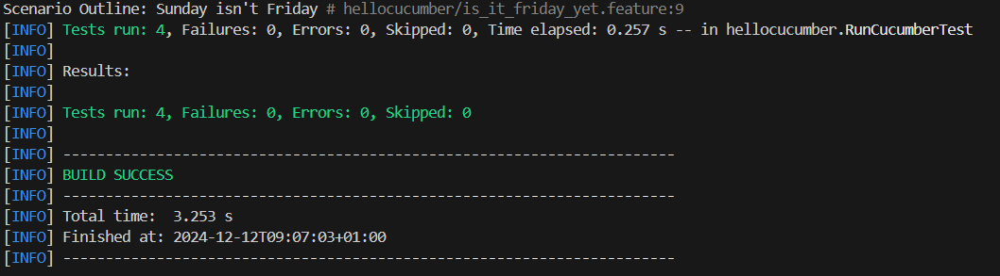

= R5.A.08 -- Dépôt pour les TPs
:icons: font
:MoSCoW: https://fr.wikipedia.org/wiki/M%C3%A9thode_MoSCoW[MoSCoW]

Ce dépôt concerne les rendus de mailto:A_changer@etu.univ-tlse2.fr[eliot desportes].

== TP1

[source,java]
  Scenario Outline: Sunday isn't Friday
  Examples:
    | day            | answer |
    | Friday         | TGIF   |
    | Sunday         | Nope   |
    | anything else! | Nope   |

== TP2...
